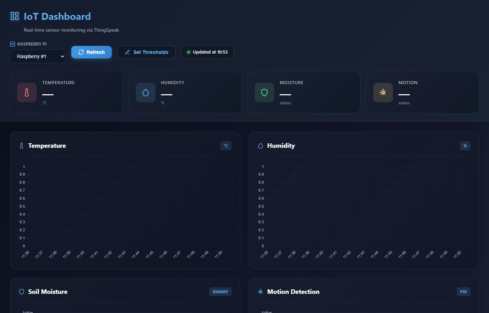

# 🌡️ IoT Threshold Email Alert Dashboard

> Real-time IoT sensor monitoring with automated email alerts — built with ThingSpeak, Chart.js, Node.js, and SendGrid.


---

## 📸 Demo

**🌐 Live:** [iot-dashboard-alerts.vercel.app](https://iot-dashboard-alerts.vercel.app)



---

## 🚀 Features

- 📡 **Live ThingSpeak Integration** — Continuously polls real sensor feeds (temperature, humidity, soil moisture, PIR/motion)
- 📊 **Interactive Charts** — Time-series visualizations powered by Chart.js
- ⚠️ **Configurable Thresholds** — Set minimum limits per metric via an in-dashboard modal
- 📧 **Automated Email Alerts** — SendGrid dynamic templates deliver structured breach notifications
- 🔇 **Alert Cooldown** — Rate-limiting prevents repeated notification spam
- 💾 **Local Persistence** — Thresholds and recipient settings saved across browser sessions
- 🔒 **Secrets Stay Server-Side** — API keys never touch the browser

---

## 🛠️ Tech Stack

| Layer | Technology |
|---|---|
| Frontend | HTML, CSS, JavaScript, Chart.js |
| Backend | Node.js, Express |
| Email Provider | SendGrid (`@sendgrid/mail`) |
| Data Source | ThingSpeak REST API |
| Config | dotenv |

---

## 🏗️ System Architecture

```
ThingSpeak API
      │
      ▼
  Frontend (index.html + app.js)
  ├── Fetches & normalizes multi-channel feed data
  ├── Renders charts and metric cards via Chart.js
  ├── Evaluates threshold breaches on each refresh cycle
  └── POSTs alert payload to backend on breach
      │
      ▼
  Backend (server.js — Express)
  ├── Validates payload and recipient email
  └── Sends email via SendGrid Dynamic Template
      │
      ▼
  Recipient Inbox 📬
```

---

## 📁 Project Structure

```
iot-threshold-email-alert-dashboard/
│
├── index.html                    # Dashboard UI and threshold modal
├── app.js                        # Frontend logic: ThingSpeak fetch, threshold checks, alert calls
├── server.js                     # Express server and /api/send-alert endpoint
├── tests/
│   └── trigger-email.test.js     # Script to trigger and verify a real email alert
├── assets/
│   └── screenshot.png            # Dashboard preview
├── .env                          # Environment variables (not committed)
└── README.md
```

---

## ⚙️ Setup

### 1. Clone the Repository

```bash
git clone https://github.com/anishonly121/iot-threshold-email-alert-dashboard.git
cd iot-threshold-email-alert-dashboard
```

### 2. Install Dependencies

```bash
npm install
```

### 3. Configure Environment Variables

Create a `.env` file in the project root:
```env
SENDGRID_API_KEY=your_sendgrid_api_key
SENDGRID_FROM_EMAIL=verified_sender@example.com
SENDGRID_TEMPLATE_ID=your_dynamic_template_id
ALERT_TEST_TO_EMAIL=recipient@example.com
PORT=3000
```

> ⚠️ `SENDGRID_FROM_EMAIL` must be a verified sender in your SendGrid account.

### 4. Start the Server

```bash
npm start
```

Open your browser at `http://localhost:3000`

---

## 🔄 End-to-End Flow

1. User opens the dashboard and sets threshold values via the modal
2. Dashboard polls ThingSpeak feeds at a configured refresh interval
3. Latest values are parsed and rendered in charts and metric cards
4. Breach detector checks whether temperature or humidity drops below the minimum threshold
5. On breach (and if cooldown allows), frontend sends alert payload to the backend
6. Backend validates the request and calls SendGrid with dynamic template data
7. Recipient receives a structured email with metric, value, threshold, device, and timestamp
8. Alert state is persisted locally to prevent duplicate notifications

---

## 📧 SendGrid Template — Dynamic Fields

Your SendGrid template must reference these exact keys:

| Field | Description |
|---|---|
| `metric` | Sensor type (e.g. `Temperature` or `Humidity`) |
| `value` | Observed sensor reading at breach time |
| `threshold` | Configured minimum threshold |
| `condition` | Breach description (e.g. `below minimum`) |
| `device` | Device context (e.g. `Raspberry #1`) |
| `time` | Localized timestamp string |

---

## 🧪 Running the Email Trigger Test

To send a real alert payload to the backend and verify delivery:

```bash
npm run test:email
```

---

## ⚡ Alert Logic

- Evaluated on each dashboard refresh cycle
- Condition: reading is **below** the configured minimum threshold
- Emails are rate-limited by a configurable `cooldownMinutes` value
- A new breach after recovery can trigger immediately

---

## 🔒 Security & Reliability

- All secrets stored server-side in `.env` — never exposed to the client
- Input validation checks recipient email format before sending
- Backend returns explicit error messages to aid debugging
- Cooldown logic reduces notification noise and alert storms

---

## ⚠️ Known Limitations

- Single-user, browser-local settings (resets if local storage is cleared)
- Breach logic covers only below-minimum thresholds for temperature and humidity
- No persistent database; delivery tracking (opened/bounced) not yet in-app

---

## 🔮 Future Improvements

- [ ] Per-user authentication and per-device alert profiles
- [ ] Retry/backoff logic and delivery status logging
- [ ] Deployment config for Render / Railway / Vercel
- [ ] Alert history UI with acknowledgment workflow
- [ ] Unit and integration tests for threshold and cooldown logic
- [ ] Configurable channel/metric mappings from the UI
- [ ] Webhook, SMS, and Telegram notification channels

---

## 🌐 Use Cases

- Home or greenhouse environmental monitoring
- Small server room temperature and humidity tracking
- Remote sensor watching with lightweight alerting
- Academic IoT prototype demonstrating a full data-to-alert pipeline

---

## 🙋 Author

**Anish**
- GitHub: [@anishonly121](https://github.com/anishonly121)
- LinkedIn: _[Add your LinkedIn URL here]_

---

## 📄 License

This project is open source and available under the [MIT License](LICENSE).
